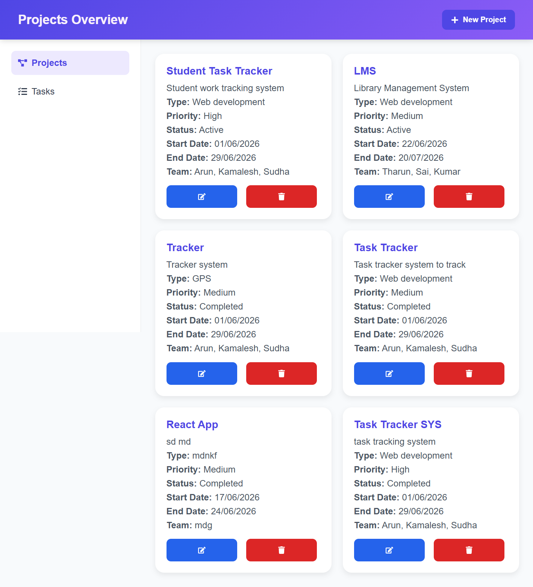
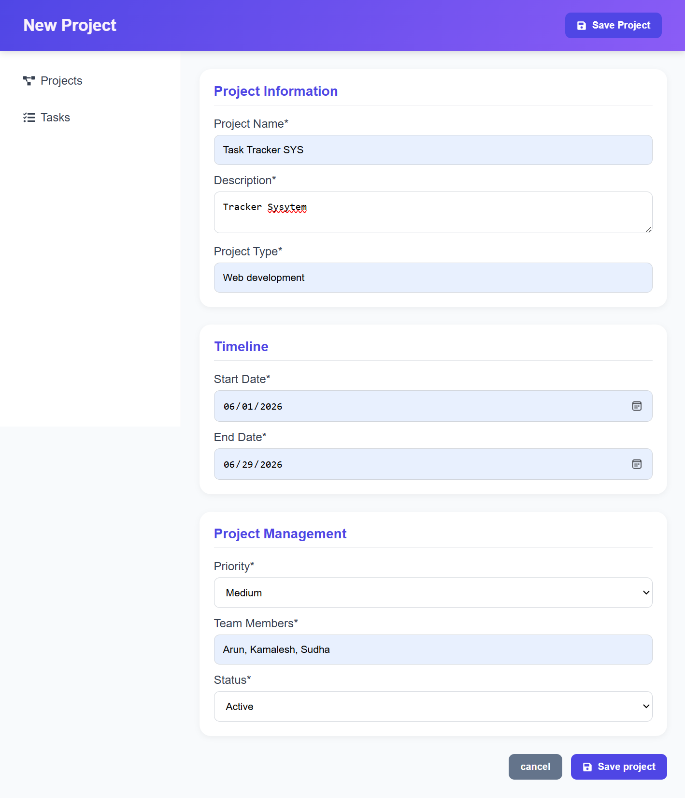
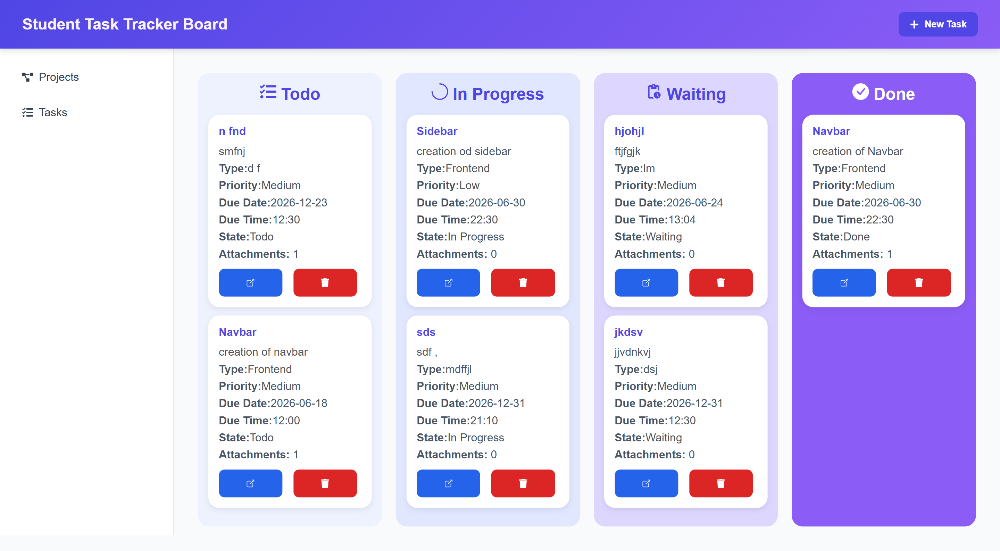
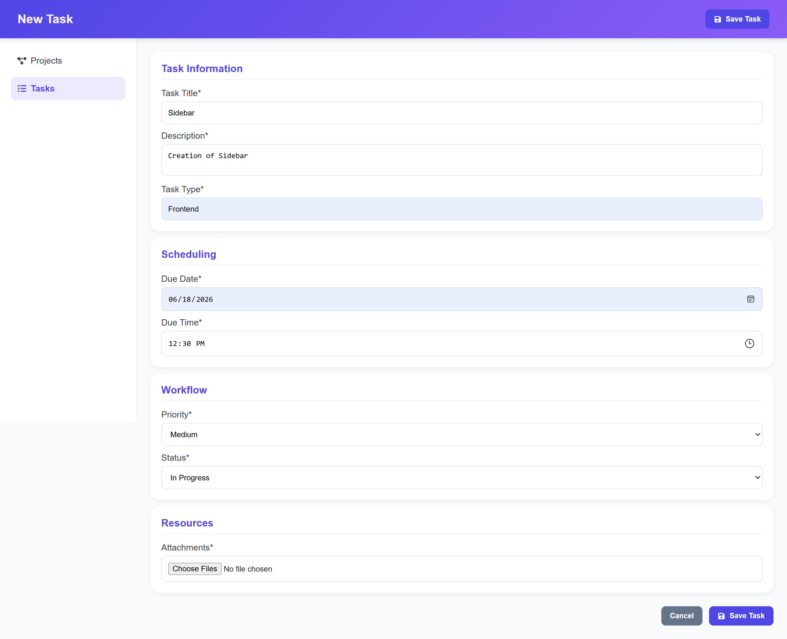
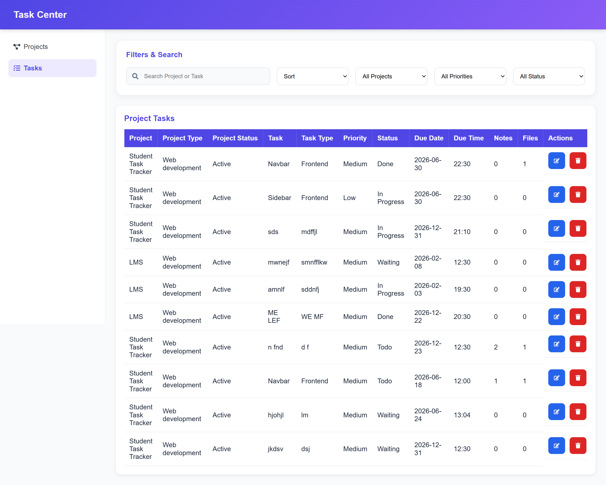
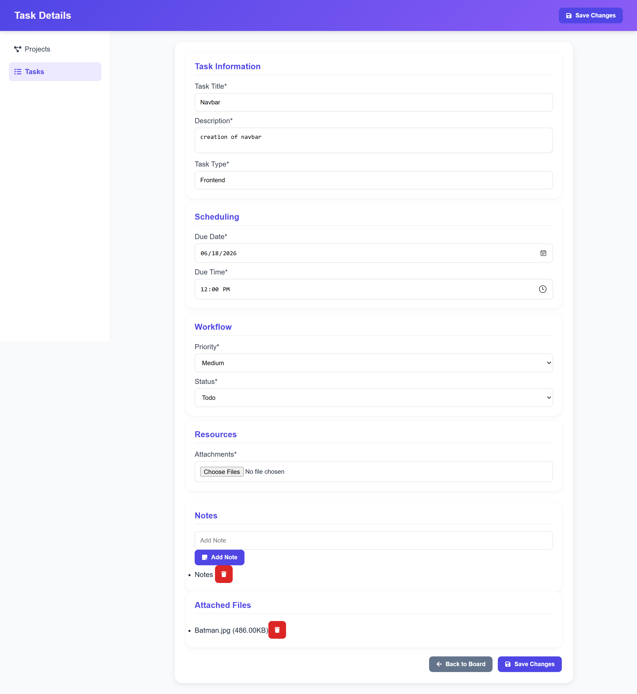

# 🚀 Project Management Dashboard

[🌐 Live Demo](https://project-management-dashboard-k.netlify.app/) • [💼 LinkedIn](https://www.linkedin.com/in/a-kamalesh/)

A modern and responsive **Project Management Dashboard** built with **React.js** that enables users to manage projects, organize tasks, and track progress through an intuitive Kanban workflow. The application features project management, task tracking, drag-and-drop functionality, local storage persistence, and a responsive user interface.

---

# ✨ Features

## 📁 Project Management

* Create New Projects
* Edit Existing Projects
* Delete Projects with Confirmation Modal
* Project Overview Dashboard
* Project Priority Tracking
* Project Status Management
* Team Member Assignment
* Project Timeline Management

---

## 📋 Kanban Board

Each project contains its own dedicated Kanban Board.

### Workflow Stages

* 📝 Todo
* 🚀 In Progress
* ⏳ Waiting
* ✅ Done

### Features

* Drag & Drop Tasks
* Real-Time Status Updates
* Project-Specific Task Boards
* Responsive Board Layout
* Task Progress Visualization

---

## ✅ Task Management

* Create Tasks
* Edit Tasks
* Delete Tasks
* View Task Details
* Due Date & Time Tracking
* Task Priority Management
* Task Status Tracking
* Task Type Categorization

---

## 📎 Attachments

* Upload Multiple Attachments
* View Attachment Count
* Remove Attachments

---

## 📝 Notes

* Add Notes to Tasks
* Remove Notes
* Track Task Updates

---

## 🔍 Task Center

A centralized page for managing all tasks across projects.

### Features

* Search Projects & Tasks
* Filter by Project
* Filter by Priority
* Filter by Status
* Sort A → Z
* Sort Z → A
* Sort by Due Date
* Quick Edit Access

---

## 🗑️ Confirmation Modals

* Delete Project Confirmation Modal
* Delete Task Confirmation Modal

---

## 💾 Local Storage Persistence

All application data is stored locally in the browser.

### Stored Data

* Projects
* Tasks
* Notes
* Attachment Metadata

### Benefits

* No Backend Required
* Data Persists After Refresh
* Fast Performance

---

## 📱 Responsive Design

* Desktop Optimized
* Tablet Friendly
* Mobile Responsive
* Fixed Navbar
* Fixed Sidebar Navigation
* Modern Dashboard Layout

---

# 🛠️ Tech Stack

## Frontend

* React.js
* React Router DOM
* React Context API
* React Hooks

## State Management

* Context API
* Local Storage

## Drag & Drop

* @hello-pangea/dnd

## Icons

* React Icons

## Styling

* CSS3
* Flexbox
* CSS Grid
* Media Queries

---

# 📂 Project Structure

```text
project-management-dashboard
│
├── public
│   ├── favicon.png
│   ├── favicon.svg
│   └── icons.svg
│
├── src
│   │
│   ├── components
│   │   │
│   │   ├── common
│   │   │   ├── DeleteModal.jsx
│   │   │   ├── Layout.jsx
│   │   │   ├── Navbar.jsx
│   │   │   └── Sidebar.jsx
│   │   │
│   │   ├── projects
│   │   │   ├── ProjectCard.jsx
│   │   │   └── ProjectForm.jsx
│   │   │
│   │   └── tasks
│   │       ├── KanbanColumn.jsx
│   │       ├── TaskCard.jsx
│   │       └── TaskForm.jsx
│   │
│   ├── context
│   │   ├── ProjectContext.jsx
│   │   └── TaskContext.jsx
│   │
│   ├── pages
│   │   ├── CreateProjectPage.jsx
│   │   ├── CreateTaskPage.jsx
│   │   ├── EditProjectPage.jsx
│   │   ├── EditTaskPage.jsx
│   │   ├── KanbanPage.jsx
│   │   ├── ProjectsPage.jsx
│   │   └── TasksPage.jsx
│   │
│   ├── routes
│   │   └── AppRoutes.jsx
│   │
│   ├── utils
│   │   └── storage.js
│   │
│   ├── App.css
│   ├── App.jsx
│   ├── index.css
│   └── main.jsx
│
├── .gitignore
├── eslint.config.js
├── index.html
├── netlify.toml
├── package.json
└── package-lock.json
```

---

# ⚙️ Installation

## Clone Repository

```bash
git clone https://github.com/your-username/project-management-dashboard.git
```

## Navigate to Project Folder

```bash
cd project-management-dashboard
```

## Install Dependencies

```bash
npm install
```

## Start Development Server

```bash
npm run dev
```

---

# 🚀 Build for Production

```bash
npm run build
```

The production build will be generated inside:

```text
dist/
```

---

# 🌐 Deployment

The application is deployed on Netlify.

### Live Website

https://project-management-dashboard-k.netlify.app/

### Build Command

```bash
npm run build
```

### Publish Directory

```text
dist
```

---

# 📸 Screenshots

## 📁 Projects Overview

*Add Screenshot Here*



---

## ➕ Create Project

*Add Screenshot Here*



---

## 📋 Project Board

*Add Screenshot Here*



---

## ➕ Create Task

*Add Screenshot Here*



---

## 📊 Task Center

*Add Screenshot Here*



---

## ✏️ Task Details

*Add Screenshot Here*



---


## 🌳 Git Workflow

The project was developed using a feature-based branching strategy.

### Branches

```text
main
develop

feature/project-crud
feature/kanban-layout
feature/task-create
feature/task-edit
feature/task-details
feature/attachment-upload
feature/search-filter
feature/local-storage
feature/project-improvements
feature/responsive-ui
feature/tasks-table-page
feature/ui-enhancements
feature/v2-layout-refactor
```

### Workflow

```text
feature/*
    ↓
 develop
    ↓
   main
```
---

# 🎯 Learning Outcomes

Through this project, the following concepts were implemented and practiced:

* React Component Architecture
* React Router Navigation
* Context API State Management
* Local Storage Persistence
* Drag & Drop Functionality
* CRUD Operations
* Responsive Dashboard Design
* Reusable Components
* Modern UI/UX Design Principles

---

# 🔮 Future Improvements

### Authentication & Security

* User Authentication
* User Registration
* Protected Routes

### Collaboration Features

* Team Collaboration
* Task Comments
* Activity Logs

### Notifications

* Due Date Reminders
* Email Notifications
* In-App Alerts

### Data Management

* Backend Integration
* Cloud Database Storage
* Real File Upload Storage
* REST API Integration

### Dashboard Enhancements

* Analytics Dashboard
* Productivity Reports
* Project Statistics
* Task Completion Charts

### UI Improvements

* Dark Mode
* Calendar View
* Theme Customization
* Advanced Filtering

---

# 👨‍💻 Author

## Kamalesh A

Computer Science Undergraduate (2027)

### Connect With Me

* LinkedIn: https://www.linkedin.com/in/a-kamalesh/
* Live Demo: https://project-management-dashboard-k.netlify.app/

---

⭐ If you found this project useful, consider giving it a star on GitHub.
